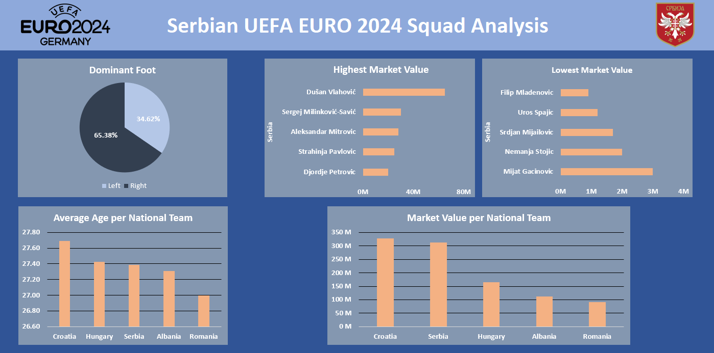

# Serbian EURO 2024 Squad Analysis

Data Analysis | Descriptive Analysis | Microsoft Excel Project

## Description
- Analyzing Serbian EURO 2024 Squad:
1. Dominant Foot Distribution;
2. Five Lowest/Highest Market Value Players;
3. Comparing Serbian and Neighboring Participant Squads (Albania, Croatia, Hungary, Romania) per Average Age and Squad Market Value;

## Project Workflow:
-	Getting Data From Kaggle (link: https://www.kaggle.com/datasets/damirdizdarevic/uefa-euro-2024-players);
-	Data Import (from .CSV file, changing File Origin to 65001: Unicode UTF-8);
- Data Inspection/Profiling;
- Data Cleaning (Getting Rid of Blanks and “-“ in Foot Column, Converting Market Value Column to Currency); 
- Data Analysis (Using Pivot Tables To Answer Questions);
- Data Visualization (Creating Dashboard using different types of charts);

## Dashboard

